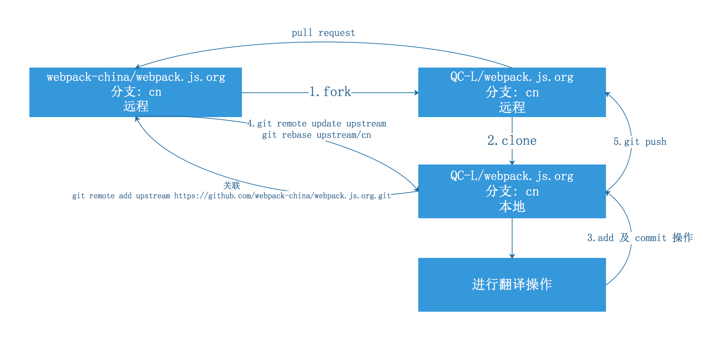

<div align="center">
  <a href="https://docschina.org">
    
  </a>
</div>

<h2 align="center">主要链接</h2>

* 首页链接：https://docschina.org
* git 仓库：https://github.com/docschina
* 群聊：https://docschina.org/talk
* 团队：https://docschina.org/team
* gitter：https://gitter.im/docschina
* slack：https://docschina.slack.com/

<h2 align="center">授权方式</h2>

- 印记中文所有的翻译文档，统一遵循 [“保留署名—非商用”创意共享 4.0 许可证（CC BY-NC 4.0）](https://creativecommons.org/licenses/by-nc/4.0/deed.zh) 授权方式。
- 你不用知会我们就可以转载，但**必须保持署名为“印记中文”，以及链接到 https://docschina.org ，并且不得去掉本页入口链接，也不得修改文档内容），并且不得用于商业目的**。
- 如果需要进行任何商业推广，请接洽 印记中文负责人李成熙(@lcxfs1991)（QQ: 249806703 && 邮箱：lcxfs1991@gmail.com），我们将给出积极的回应。


webpack 中文文档
========
[](https://travis-ci.org/docschina/webpack.js.org)

## 翻译 ##

> [webpack 中文文档](https://webpack.docschina.org)
> [webpack 中文社区](https://webpack-china.org)


### 中文站点
- [英文站点](https://webpack.js.org/)是由 CI 自动构建并部署到 gh-pages 分支。
- [中文站点](https://webpack.docschina.org/)是由 CI 自动构建并部署到 gh-pages  分支。


### 印记中文翻译流程
- **[（必读）印记中文翻译流程（一）：仓库和分支介绍](http://mp.weixin.qq.com/s/_ricIlWhDbRZW-CmH0Ik5w
)**
- **（必读）感谢 @QC-L 同学简洁易懂的配图**


### 开发

```javascript
npm install
npm start
打开 localhost:3000
```


### 说明

- [说明 - 你想要知道的所有都在这里了](https://github.com/webpack-china/webpack.js.org/issues/17)

- [翻译人员名单](https://webpack.docschina.org/about/)中如未收录你的名字，请[访问此处](https://github.com/webpack-china/webpack.js.org/issues/180)留下你的大名(^_^)

- Thanks
